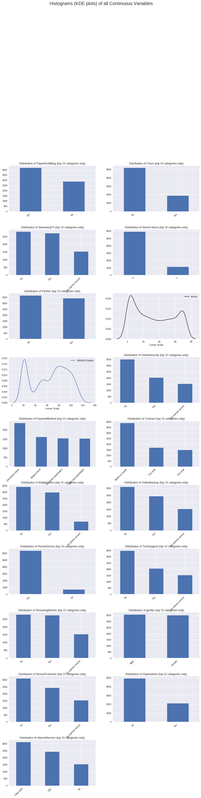
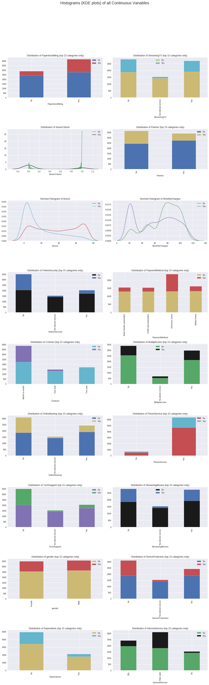
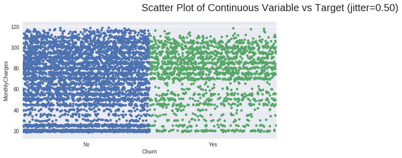
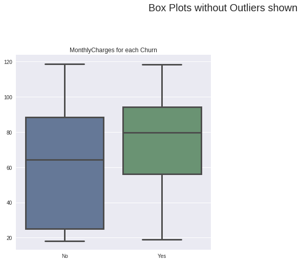

# Explonatory Analysis over Churn Dataset using AutoViz

### Using the dataset we are trying to see the trends and the factors that can cause users to churn

#### 1. Exploring the dataset to find out unqique values and distribution of the datasets.

#### 2. Exploring the dataset and analysing how the users have churned based on diffrent parameters

#### 3. Scatter Plot and Box Plot based on Monthly Charges

